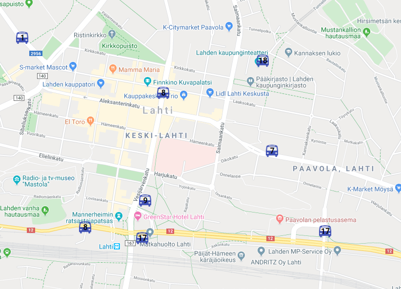

# Lahti buses on a map
This simple Node.js app fetches real time bus location data from the LSL / Waltti API and displays the buses on Google maps.

## How to install
- Install Node.js (see https://nodejs.org/en/download/)
- Run `npm install` in the root folder - this installs dependencies
- Register a Waltti Id account - see https://opendata.waltti.fi/getting-started
- Insert your Waltti credentials into file .env at the root folder of the app (see 'configuration' below)
- Register a Google cloud platform account - see https://developers.google.com/maps/gmp-get-started
- Create an API key for use in Google Map Javasript API - see https://developers.google.com/maps/documentation/javascript/get-api-key
- Insert your Google API key into the google maps URL at the end of public/index.html
- Create self-signed certificate using openSSL by running this command at the project root: `openssl req -x509 -newkey rsa:4096 -keyout key.pem -out cert.pem -days 365`. This will create a certificate and write files key.pem and cert.pem to the project root folder.

## How to run locally
- Start the web server by running `npm start` - this will start the server at localhost:3001 and the bus data fetcher routine
- Navigate to https://localhost:3001 on your browser

## Configuration
To run locally, create a file named `.env` at the root of the app and add the following content (filling in your own Waltti credentials)
WALTTIUSERNAME=xxx
WALTTIPASSWORD=xxx
BUSDATAFETCHINTERVAL=5000
PORT=3001
CITY=lahti

## How it works
The fetcher retrieves data from the Waltti API and writes the data in JSON format into the file /data/buses.json. The server serves data from that file upon requests to the path http://localhost:3001/buses. The frontend polls the backend and updates a Google maps map according to the data, creating an icon for every bus that the backend returns.
